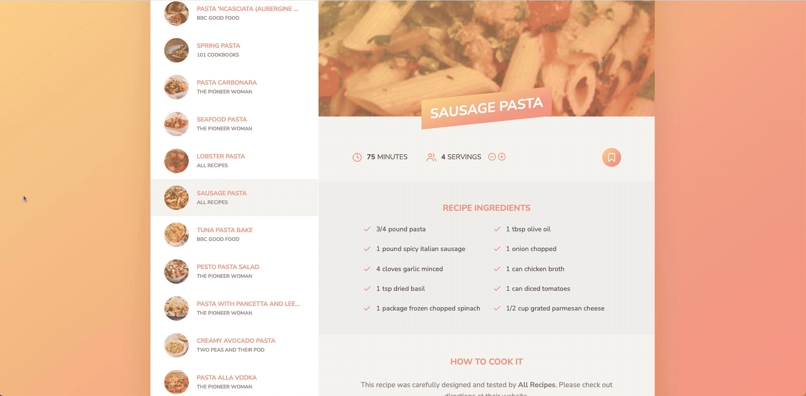
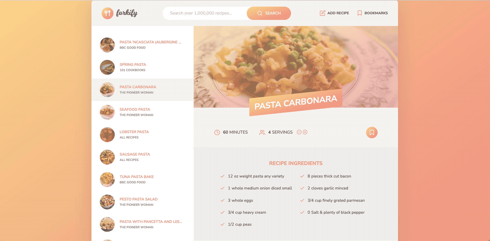
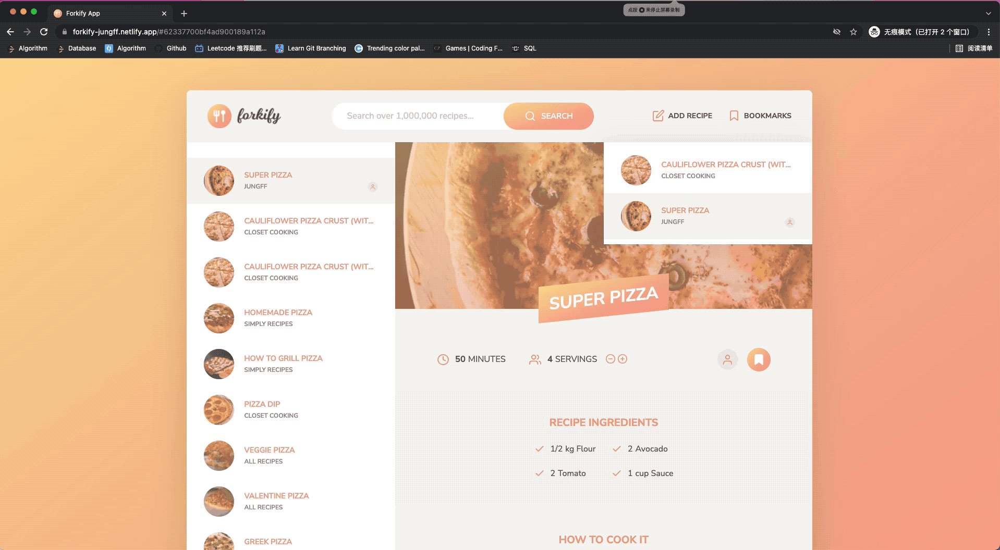
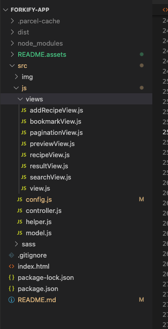

# forkify

## A Web App to search Recipe using the Forkify-API

- Project Link - [forkify](https://forkify-search.vercel.app/)

## Topics Covered

(Javascript, API, Parcel | Module bundler, DOM Manipulation, HTML, CSS etc)

## Installation

1. Download node.js .
   [node.js](https://nodejs.org/en/download/)

2. Navigate to your folder where you have extracted the repository & Install all the dependencies using the following command in the command prompt.

```bash
npm install package.json
```

3. Run the webite locally.

```bash
npm run start
```

### External libraries and APIs:

- Parcel
- Sass
- [Forkify-API](https://forkify-api.herokuapp.com/v2)

### Features

- All in One Recipe Finder using JavaScript and Forkify-API API.

- Uses AJAX API calls to retrieve data from the Forkify API.

- Dynamic Search options for recipes.

- Renders Recipes and Ingredients.

- Can store your recipe.

- Search any food to recieve a list of recipes containing that ingredient.


- Change the servings size to alter the needed ingreident count proportionally.



- Easily bookmark or unbookmard the selected recipe.



- Create your own recipes and store them as user recipes(use a special icon).


- LocalStorage keeps the data when users exit the app.



### Project Architecture



Built using the MVC Architecture. View class extends the rest of the components. Controller keeps both directional dataflow. Model makes http requests.


# About ME

- 📃 Resume - [Resume](https://drive.google.com/drive/folders/1OwC5M27fsk72OzUIzXEc5ij6_b0xYhxR/)
- 💼 Portfolio - [Portfolio](https://shantanu-nautiyal-portfolio.vercel.app/)
- 📫 How to reach me: [Linkedin:@Shantanu-Nautiyal](https://www.linkedin.com/in/Shantanu-nautiyal)
- Let's connect and discuss how we can achieve remarkable results together.
